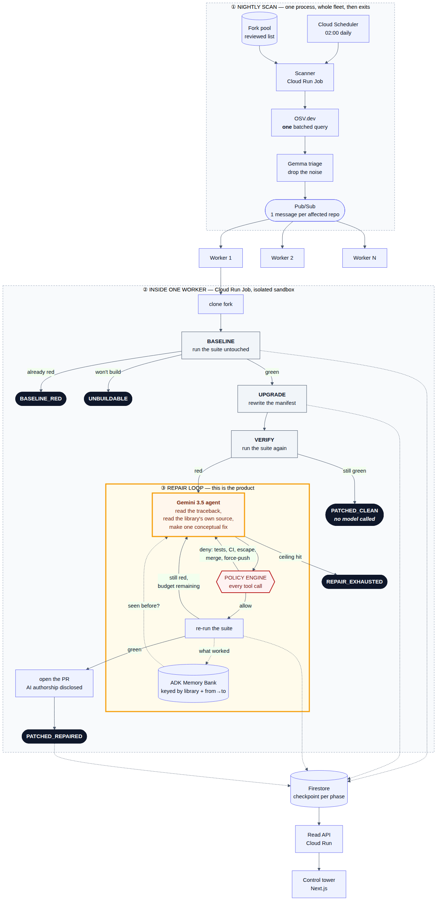

<div align="center">

# 🌙 Nightshift

**Dependabot opens the PR and walks away. Nightshift stays.**

An agent fleet that finds vulnerable dependencies across hundreds of repositories,
upgrades them, and **repairs the code the upgrade breaks** — governed, auditable,
and finished by morning.

[Architecture](docs/architecture.md) · [Decisions](docs/decisions/) · [Responsible use](RESPONSIBLE_USE.md)

</div>

---

## The problem

Version-bump bots are a solved problem. Dependabot and Renovate will find the
vulnerable pin and open the pull request, and they do it well.

Then they walk away — and a large share of those pull requests fail CI, because
the patched version moved an API. Someone has to read the traceback, work out
that the library's `Session.request()` no longer accepts `timeout` positionally,
rewrite the call site, and push. That human step is why security upgrades sit
open for months at organisational scale.

**That step is what Nightshift automates.** Not the version bump — the repair.

And it only does it once. Vulnerable pins cluster hard: a handful of transitions dominate
any few hundred Python repositories. So every repair Nightshift completes is generalised
into a **migration recipe**, and the fortieth repository to hit `jinja2 2.11→3.1` starts
from the answer instead of the traceback. **Cost per repository falls as the fleet works.**

## What it does, in one night

```
02:00  Cloud Scheduler wakes the scanner
02:01  One batched OSV.dev query covers every pinned dependency in the fleet
02:01  Triage drops the advisories not worth waking a worker for      ◦
02:02  One Pub/Sub message per affected repository; the scanner exits
02:02  Cloud Run workers fan out, one per repository:

         BASELINE   run the suite untouched  ──▶ nothing passes?  BASELINE_RED
                                             ──▶ won't build?     UNBUILDABLE
                                             ──▶ mostly red?      UNBUILDABLE — ours
         UPGRADE    rewrite the manifest
         VERIFY     run the suite again      ──▶ nothing new red?  PATCHED_CLEAN
         LEDGER     has the fleet solved this transition before?
         REPAIR     bounded Gemini loop      ──▶ fixed it?      PATCHED_REPAIRED
                                             ──▶ ran out?       REPAIR_EXHAUSTED
         LIBRARIAN  generalise the fix into a recipe for next time
         REVIEW     second opinion on the diff                        ◦
         PR         opened, authorship disclosed, nothing merged

08:00  A human opens the control tower and reads what happened.
```

`◦` marks a step that is designed and specified but **not built**: triage is a
deterministic severity floor today rather than a Gemma pass, and no Reviewer
agent exists. Everything else in that column has run, in the cloud, against real
repositories.

## The Migration Ledger

Four agents, each with a genuinely different job:

| Agent | Model | Job | Built |
|---|---|---|---|
| **Triage** | Gemma 3 | Is this advisory worth waking a worker for? | severity floor only |
| **Repair** | Gemini 3.5 Flash | Read the traceback, rewrite the call site. | yes |
| **Librarian** | Gemini 3.5 Flash | Generalise a finished repair into a reusable recipe. | yes |
| **Reviewer** | Gemini 3.5 Flash | Second opinion on the diff before the PR opens. | no |

The design escalates Repair and Librarian to Gemini 3.5 Pro. Vertex serves no
Pro to this project in any region, so both run on Flash and the escalation tier
degrades to a second Flash pass rather than failing the job.

The Librarian is the one that makes the fleet an institution rather than a batch job. It
reads a repair that worked and writes back a rule — *"Jinja2 3.0 removed the top-level
`Markup` and `escape` re-exports; import them from `markupsafe`"* — scoped by
`{library, from_version, to_version}`. It never sees a repository and cannot modify one:
its ADK agent is built with an empty tool list, which is a boundary rather than an
omission and has a test holding it there.

The scope key is designed for Vertex AI Memory Bank and **runs on Firestore today**.
Exact retrieval is identical either way; `near` is served by a deliberately crude
stand-in for Memory Bank's similarity search, and swapping the backend is one
implementation of one protocol.

Retrieval is three-tier: an **exact** scope hit, a **near** hit found by similarity search
across adjacent transitions of the same library, or a **miss** that pays full price and
teaches the Ledger something new. A recipe is provisional when written and verified only
after two independent confirmations.

**A recipe is a hint, never an instruction.** The success criterion never moves: the suite
passes and the tests were not modified. A wrong recipe costs attempts. It cannot
manufacture a false green. Full reasoning in [ADR 0004](docs/decisions/0004-the-migration-ledger.md).

## The three things that make it trustworthy

**The agent cannot touch the tests.** An agent asked to make a red suite green
will, given the chance, delete the failing test. That is the most likely way
this project could produce a convincing lie, so writes to test files are denied
by the policy engine — a code path, covered by tests, not a line in a prompt.
Writes to CI configuration are denied for the same reason.

**Baseline first, always.** Before anything is changed the suite runs as it
arrived. Without that run, every number we report would be taking credit for
breakage we did not cause.

What the baseline decides took two rounds of measurement to get right. Demanding
a perfectly green suite sounds rigorous and is not — it discards a repository
with a hundred passing tests over one failure belonging to our container. So a
suite where *nothing* passes is `BASELINE_RED`; one where fewer than half pass
is our limitation and says so; and above that the repository is usable, with the
tests that were already red recorded by name and set aside. **The break is what
the upgrade changed**, not what was red when we arrived.

**Failure is a first-class result.** `Outcome` is a closed enum in which
`UNBUILDABLE` and `BASELINE_RED` are ordinary members. Repositories we could not
help stay in the denominator, which is what turns "repair rate" from a claim
into a number:

```
repair rate = PATCHED_REPAIRED / (PATCHED_REPAIRED + REPAIR_EXHAUSTED)
```

Of the upgrades that actually broke something — how many did the agent fix?

## What we measured

Two tiers, reported separately and never added together. The method is in
[`benchmark/README.md`](benchmark/README.md); these are the numbers as they stand.

**Tier A — the repair loop, on a known break.** One authored case: `jinja2
2.11.3 → 3.1.2`, where 3.0 removed the top-level `Markup` re-export and the
suite fails during collection. Repaired on the first attempt, 8,238 tokens, one
line changed, tests untouched, [pull request
open](https://github.com/Varshavia/nightshift-case-jinja2-2.11-to-3.1/pull/1).
We wrote this case, so it says something about the agent and nothing about the
world.

**Tier B — the wild set, and the number that surprised us.** 42 forked
repositories, 57 verdicts reached in the deployed fleet:

| | |
|---|---|
| Reached the upgrade | 0 |
| `BASELINE_RED` — the suite does not pass here | 32 |
| `UNBUILDABLE` — the environment would not come up | 19 |
| `INFRA_ERROR` — our own fault, mostly a bad pytest invocation | 6 |

Zero repairs, and the reason is not that the agent failed. **It is that fifty-one
of fifty-seven repositories never got as far as being asked.** The bottleneck in
automated dependency repair is not the repair — it is reproducing somebody
else's environment well enough to run their tests: system libraries, fixtures
that want a database, wheels that exist for one platform.

The second finding is quieter and cuts the same way. OSV answers with the
*lowest* version carrying a fix, which is usually a patch release, and patch
releases break almost nothing. Most security upgrades genuinely are a version
bump — Dependabot handles them and Nightshift has nothing to add. What the fleet
is for is the minority where the fix is a major version away, which is why
candidates are ranked by `likely_to_break` rather than by advisory count.

Neither number is flattering and both are the point. A repair rate computed over
a denominator we curated would have been higher and worth less.

## Architecture



Every tool call the agent makes passes through the policy engine before
execution. It is a pure function of `(ToolCall, Budget)` — no I/O, no clock —
which is why it can be tested exhaustively and why it is the most heavily tested
module in the repository. Full write-up: [`docs/architecture.md`](docs/architecture.md).

## Stack

| | |
|---|---|
| **Gemini 3.5 Flash → Pro** | Repair, Librarian and Reviewer. Flash carries most breaks; Pro is reached for after two failed attempts |
| **Gemma 3** | Cheap triage over raw advisories, before an expensive model is woken |
| **ADK 2.0** | Agent runtime and policy-wrapped tools — the agent never holds an unwrapped tool |
| **Memory Bank** | The Migration Ledger, scoped by `{library, from→to}` so the fortieth repository is nearly free |
| **Cloud Trace / OTel** | `ledger.hit`, `agent.version`, `policy.rule`, tokens. The cost curve is a query over spans, not a spreadsheet |
| **Cloud Run Jobs** | Scanner and per-repository workers; isolation per job, no idle cost between nights |
| **Pub/Sub** | Fan-out, one message per affected repository |
| **Cloud Scheduler** | The 02:00 trigger |
| **Firestore** | Job state and the Ledger of record, checkpointed at every phase transition |

## Quick start

```bash
git clone https://github.com/Varshavia/nightshift.git
cd nightshift

python -m venv .venv && source .venv/bin/activate   # Windows: .venv\Scripts\activate
make install

make check          # ruff · mypy --strict · pytest
```

That runs with no credentials and no cloud access: the domain is deliberately
free of infrastructure so the suite runs on a laptop.

To run the Tier A regression cases — the repair loop against known breaks, and the
only place a model is called on demand:

```bash
cp .env.example .env     # project, fork org, GitHub token; see the file's comments
make benchmark           # or: make benchmark CASE=jinja2-2.11-to-3.1
```

To run against a real repository end to end:

```bash
make run-local REPO=owner/name
```

To deploy the fleet:

```bash
./infra/deploy.sh        # idempotent; least-privilege service accounts
```

Two things the deployment will not tell you if you get them wrong.
`NIGHTSHIFT_MODEL_LOCATION` defaults to `global` because Vertex publishes new
Gemini versions there first and to named regions later — asking `us-central1`
for Gemini 3.5 Flash returns a 404 that reads like a permissions problem. And
the probe refuses to run outside Linux, because verdicts from a laptop describe
the laptop: `triton` publishes no Windows wheel, so a repository comes back
UNBUILDABLE for a reason that has nothing to do with it.

## Repository map

```
packages/nightshift_core/   models · osv · policy · config · store · ledger · telemetry
services/scanner/           nightly scan, publishes jobs, then exits
services/worker/            per-repo agents: toolchain · tools · repair · agent · pull_request
services/api/               read model, approvals, and the control tower itself —
                            one server-rendered page, no build step, no chat UI
scripts/                    fork pool construction, vetting, and the zero-token probe
benchmark/                  two-tier method: authored cases (A) and discovered ones (B)
infra/deploy.sh             idempotent GCP deployment
templates/pr_body.md        PR body, includes mandatory AI-authorship disclosure
docs/superpowers/           design specs and implementation plans
```

## Status

| | |
|---|---|
| ✅ Domain, policy engine, OSV client, stores, manifests | implemented, `mypy --strict` |
| ✅ Worker toolchain — clone, build, test, upgrade | implemented, calls no model |
| ✅ Zero-token fleet probe and the two-tier benchmark | implemented |
| ✅ Repair loop | implemented; has repaired a real break and opened the PR |
| ✅ Librarian | implemented; no tools, by signature |
| ✅ Control tower | live, server-rendered, public read |
| ✅ Deployed fleet — scanner, workers, API on Cloud Run | running |
| ✅ CI, Dockerfiles, deployment script | working |
| ✅ Architecture, diagram, four ADRs, Ledger design | written |
| 🚧 Gemma triage pass, Reviewer, Agent Registry, Model Armor | designed, not built |

Stubs raise rather than return empty. A broken scan must not look like a quiet
night.

**Live state — what is green right now, what is blocked, what is next — lives in
[`SESSION_SUMMARY.md`](SESSION_SUMMARY.md), not here.** This file describes the project;
that one describes today.

## Responsible use

The fleet operates on **forks in an organisation we control**.
`ALLOW_UPSTREAM_PRS=false` by default and the policy engine enforces it. Nothing
merges itself; there is no auto-merge implementation and no flag that enables
one. Every pull request discloses that it was written by an AI agent and invites
the maintainer to tell us to stop. See [RESPONSIBLE_USE.md](RESPONSIBLE_USE.md).

## Licence

Apache-2.0.

---

<div align="center">
Built for the <b>All Things Agentic Hackathon</b> · The Fortified Enterprise Fleet
</div>
